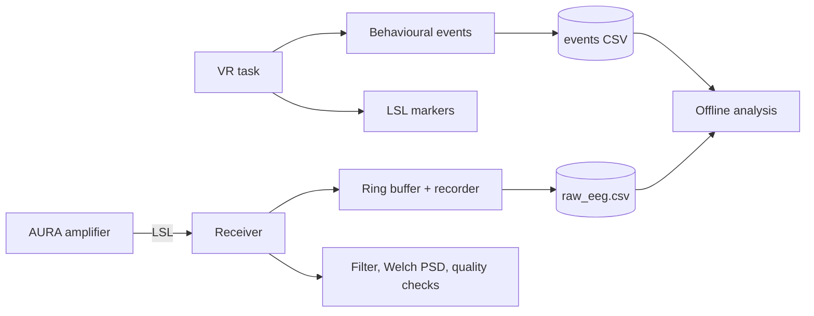

# EEG-VR Cognitive Assessment

A Unity VR research prototype that runs a visual verbal-recognition memory task while recording EEG from an AURA amplifier.

## About the project

A participant wearing a Meta Quest 2 headset reads a list of words, is tested on which ones they recognise, does an unrelated task in a virtual showroom, and is then tested again after the delay. While that happens, EEG is streamed from an AURA amplifier into Unity over Lab Streaming Layer (LSL), and both the behavioural events and the EEG samples are written to disk with timestamps that can be lined up afterwards.

The point of the project, at this stage, is the data collection itself. Getting VR events and a separate EEG amplifier onto a common timeline is an engineering problem that has to be solved convincingly before any of the interesting questions about memory or workload can be asked. So most of the effort here has gone into recording everything needed to reconstruct a session from files alone, and into checking the signal quality rather than assuming it.

A few things this project is **not**:

- It is **not a medical device or a diagnostic system**, and it has not been clinically validated. Nothing it produces should be used to make a judgement about anyone's cognition or health.
- It **does not adapt the task based on EEG**. A neuroadaptive controller is a long-term goal, not something that exists in this repository.
- It is a **research prototype** built for a student project, tested by one developer. There has been no pilot cohort.

EEG amplitudes are reported in AURA native units throughout, because the scaling to microvolts has not been formally verified. Nothing here should be compared against a published figure in microvolts.

## Experimental workflow

The environment is split into three areas the participant is moved between. The default protocol mode is `Recognition`.

| Stage | Area | What happens |
| --- | --- | --- |
| Language selection | — | Participant picks English, Spanish or Japanese |
| Practice | Area 0 | Getting used to pointing and selecting in VR; not scored |
| Encoding | Area A | Fifteen words shown on screen, one at a time |
| Immediate recognition | Area A | Targets mixed with new words, answered `SEEN BEFORE` / `NOT SEEN BEFORE` |
| Showroom task | Area B | Find a chair matching a described colour, size and shape; three trials |
| Delayed recognition | Area C | Same recognition test again, with different new words |
| Results | Area C | Behavioural summary, then the session ends |

The showroom task in the middle is there to fill the delay with something engaging that is not another memory test.

Each response is made by pointing at one of two on-screen buttons and pulling the controller trigger. Responses are classified by comparing what the word actually was against which button the participant selected:

- **Hit** — an old word correctly marked `SEEN BEFORE`
- **Miss** — an old word wrongly marked `NOT SEEN BEFORE`
- **Correct Rejection** — a new word correctly marked `NOT SEEN BEFORE`
- **False Alarm** — a new word wrongly marked `SEEN BEFORE`
- **No Response** — the response window ran out before either button was selected

Chair shapes are `Solid`, `Slatted` and `Curved`. These were renamed from `Modern` / `Classic` / `Rounded` partway through development; the chairs themselves did not change. Sessions recorded before the rename use the old words, so check `Assets/IKEA_EEG/Data/README_DATA_LOCATION.txt` before pooling data across builds.

## Current status

At least one complete synchronized VR and AURA EEG recording has been produced during development testing.

| Status | Feature |
| --- | --- |
| Implemented and exercised | Three-area VR flow with Quest 2 controller interaction |
| Implemented and exercised | Visual word encoding, immediate and delayed recognition |
| Implemented and exercised | Showroom chair task with deterministic, seed-based trial generation |
| Implemented and exercised | Behavioural classification and 45-column event CSV logging |
| Implemented and exercised | Trilingual interface strings (English, Spanish, Japanese) |
| Implemented and exercised | AURA EEG over LSL: eight channels at 250 Hz, clock correction |
| Implemented and exercised | Raw EEG buffering, recording, and event-synchronized markers |
| Needs further validation | Filtering, Welch PSD and band-power features |
| Needs further validation | Signal-quality checks and channel-degradation tracking |
| Needs further validation | Offline session analysis tooling |
| Needs further validation | All three language modes end to end |
| Not implemented | Neuroadaptive controller and EEG-driven difficulty adaptation |
| Not implemented | Clinical validation |
| Not implemented | Production-ready build and deployment |

The EEG side observes the experiment rather than driving it, so the behavioural task runs exactly the same whether or not an amplifier is connected.

## EEG integration



EEG arrives as an LSL stream published by the AURA acquisition software: eight channels, 250 Hz nominal, `float32`. The channel count, rate and format are read from the stream's own metadata rather than assumed, and written into the header of every recording.

Three timestamps are kept for each sample — a de-jittered analysis clock, this machine's unsmoothed LSL clock, and the sender's clock — along with the liblsl time correction between them. The unsmoothed local clock is the same one the behavioural CSV records against, and that is what makes the two files alignable afterwards. Samples go into a ring buffer so that a window can be cut around any logged event, and are written to `raw_eeg.csv` exactly as received, with no filtering or scaling applied to the stored values.

For analysis, the signal is band-pass filtered from 1 to 40 Hz with a fourth-order Butterworth, and spectra are estimated over 4-second windows using Welch's method with 2-second Hann segments at 50% overlap. That gives three segments per window. The features taken from it are frontal theta (4–8 Hz) and posterior alpha (8–12 Hz), averaged over regions of interest defined by electrode label. Channels map to Fp1, F3, Fz, F4, Cz, P3, Pz and P4 — but that mapping comes from project configuration, not from the stream, so it is only correct if the cap was actually wired that way.

Windows get flagged rather than repaired. The checks look for things like flat or saturated channels, sudden discontinuities, channels that are suspiciously similar to one another, and electrodes that were working earlier in the session and then stopped. If a flagged electrode belongs to a region of interest, that region's feature is marked invalid on its own — a failure at P3 invalidates posterior alpha without touching frontal theta. Nothing is interpolated, re-referenced or substituted; a bad value is reported as bad, not quietly replaced.

After a session, the offline analyzer replays the recording through the same filtering and spectral code the live pipeline uses, and writes plots, summary CSVs and a report into an `offline_analysis/` folder inside the session directory.

## Requirements

| Item | Requirement |
| --- | --- |
| Development computer | Windows PC able to run Meta Quest Link |
| Headset | Meta Quest 2, connected via Meta Quest Link |
| Unity Editor | `6000.3.21f1` |
| Universal Render Pipeline | `17.3.0` |
| XR Interaction Toolkit | `3.4.1` |
| OpenXR Plugin | `1.16.1` |
| Lab Streaming Layer | Included in the repository under `Assets/Plugins/` |
| EEG hardware | AURA amplifier and its acquisition software — optional, only needed for EEG sessions |

Formal minimum PC specifications have not been benchmarked. Development has been done on a machine capable of running Quest Link, and everything so far has been tested on Windows.

## Third-party Asset Store dependencies

Some scenes reference assets from the Unity Asset Store. Their licences do not permit source
redistribution, so **they are not included in this public repository** and are excluded through
`.gitignore`. They must be imported locally from the Unity Asset Store into the exact folders
below, so that the existing GUID references resolve:

| Package | Expected folder |
| --- | --- |
| Urban Props Pack | `Assets/Urban_Props_Pack_Rozity/` |
| 3D Low-Poly Modular Household Starter Pack | `Assets/JeffamazedDev/` |
| Yughues Free Architectural Materials | `Assets/YughuesFreeArchitecturalMaterials/` |
| Realistic Metal Texture | `Assets/Realistic Metal Texture/` |

Until the required packages are imported, scenes and prefabs may show missing references for the
objects that depend on them. The experiment's own logic, UI and EEG pipeline do not depend on any
of these packages and run without them.

No content, licence file or asset from these packages is copied into this repository.

## Installation and use

Clone the repository:

```bash
git clone https://github.com/MJSantoyo/EEG-VR-Cognitive-Assessment.git
cd EEG-VR-Cognitive-Assessment
```

Install Unity `6000.3.21f1` through Unity Hub — the version needs to match, since opening the project on a different Editor triggers an upgrade that has not been tested. Add **Windows Build Support (IL2CPP)**; Android Build Support is only needed if you want to build a standalone `.apk`, which is not required for normal use.

Open the project from Unity Hub and let the Package Manager restore the dependencies listed in `Packages/manifest.json`. Then open the main scene:

```
Assets/IKEA_EEG/Scenes/IKEA_EEG_Experiment.unity
```

Connect the Quest 2, start Quest Link, and press **Play**. The session begins at the language-selection screen; point with either controller and pull the trigger.

There are some helpers under the `IKEA_EEG` menu in the Editor. `Validate Experiment Scene` checks the scene is intact, `Run Self Test` runs the automated test suite, and `Researcher > Replay Same Seed` reproduces a previous randomisation.

> **Careful:** `IKEA_EEG > Build Experiment Scene` regenerates the scene from code and overwrites whatever is currently in it. Do not run it if you have manual scene edits you want to keep.

### Running with EEG

Start the AURA acquisition software first and check it is publishing its stream. Before pressing Play, it is worth confirming Unity can see it:

- `IKEA_EEG > LSL > Check AURA Stream` — confirms the stream is discoverable and reports its metadata
- `IKEA_EEG > EEG > Diagnose Channel Integrity` — confirms the eight channels are actually distinct
- `IKEA_EEG > EEG > Analyze Spectral Window` — confirms the filter settles and produces valid features

Then run the session as normal. `raw_eeg.csv` is written alongside the behavioural CSV. Afterwards, `IKEA_EEG > EEG > Offline Session Analysis…` will replay and analyse it.

### Running without EEG

This works fine and needs no configuration. With no amplifier connected the VR task runs normally, behavioural logging is unaffected, the LSL marker sink reports itself as unavailable and stays at zero markers, and no `raw_eeg.csv` is produced. It never fakes a stream or invents markers.

If you want to test the EEG code path without the hardware, `Assets/IKEA_EEG/Editor/SyntheticEegOutlet.ps1` publishes a synthetic stream from PowerShell.

### Builds

There is no build pipeline set up; everything so far has been tested in the Editor over Quest Link. Note that `SampleScene.unity` is still sitting at build index 0 with the experiment scene at index 1, so the build scene list needs reviewing before anyone produces a distributable build.

## Data outputs and privacy

Sessions are written to `Application.persistentDataPath`, which on Windows resolves to:

```
%USERPROFILE%\AppData\LocalLow\DefaultCompany\IKEA_EEG\IKEA_EEG_Data\<session_id>\
```

Each session folder contains a 45-column behavioural event CSV with both monotonic and LSL timestamps, and — if an amplifier was connected — a `raw_eeg.csv` with one row per sample. Those two are the authoritative record. Alongside them are derived files: a per-trial session summary, a human-readable researcher summary, and a blank form for offline scoring. None of the derived files ever modify the originals. Offline analysis output goes into an `offline_analysis/` subfolder.

The event CSV schema is append-only — new columns go on the end, so older analysis scripts keep working on newer files.

> **Participant data, EEG recordings, consent documents and anything identifying must never be committed to GitHub.**

`.gitignore` already excludes `**/IKEA_EEG_Data/` and `**/raw_eeg.csv`, but check `git status` before committing anyway. Session IDs are timestamp-based and contain no participant identity; if you keep a mapping from session ID to participant, keep it outside the repository.

## Known limitations

- No neuroadaptive controller — the task does not respond to EEG at all.
- No clinical validation, and no normative data for this protocol.
- EEG amplitudes are in AURA native units; the conversion to microvolts is unverified.
- The electrode montage is applied from configuration, so it is only right if the cap was physically wired to match.
- No artefact rejection or re-referencing. Ocular and movement artefacts are present in the recorded data.
- Inter-channel independence has not been established — recorded sessions have shown very high correlation between channels after filtering, and the cause has not yet been traced to hardware or montage.
- Display latency between a logged stimulus onset and the participant actually seeing it has not been measured.
- Only development testing has been done. No pilot cohort.
- Standalone on-device Quest deployment has not been validated; everything has run through Quest Link.

## Next steps

- [ ] Record and validate repeated behavioural and EEG sessions
- [ ] Verify marker timing and event alignment across sessions
- [ ] Resolve the inter-channel correlation issue at hardware or montage level
- [ ] Further validate signal-quality checks and spectral features
- [ ] Optimise the virtual environment for Meta Quest 2
- [ ] Review the build scene list
- [ ] Finish the experimental protocol documentation
- [ ] Define decision rules for future EEG-driven adaptation
- [ ] Run controlled pilot testing

## Author and license

**Mariana De Jesus Santoyo**
Biomedical Engineering Student
Tecnológico de Monterrey
GitHub: [@MJSantoyo](https://github.com/MJSantoyo)

The repository currently contains an MIT license, which covers the project's own source code. It does not override the licences of third-party components: `liblsl`, Unity-provided packages and template content, and imported package samples all remain under their original terms.

This repository is public. Unity Asset Store assets must not be committed to it unless their licence explicitly permits source redistribution — most do not. The redistribution status of the Unity template assets and imported package samples already present is still under review.
